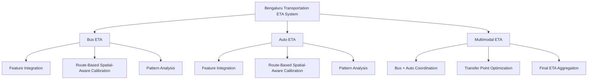

# Bengaluru Multi-Task ETA System

> **Top 10 Finalist** - IISc Bengaluru Last Mile ML Challenge (October 2025)  
> Production-ready machine learning system for predicting bus, auto-rickshaw, and multimodal journey ETAs

[](https://www.python.org/)
[](https://www.docker.com/)
[](https://opensource.org/licenses/MIT)

---

## Competition Results

- **Overall:** Top 10 Finalist team (selected for final presentation at IISc from 265 teams)  
- **Task 1 (Bus ETA):** Competitive performance with GPS trajectory analysis  
- **Task 2 (Auto ETA):** Strong results using H3 spatial features  
- **Task 3 (Multimodal): 1st Place:** 69.18 MAE with novel piecewise calibration  

---

## Table of Contents

- [Competition Overview](#-competition-overview)
- [System Architecture](#-system-architecture)
- [Task 1: Bus ETA Prediction](#-task-1-bus-eta-prediction)
- [Task 2: Auto-Rickshaw ETA](#-task-2-auto-rickshaw-eta)
- [Task 3: Multimodal Journey Prediction (1st Place)](#-task-3-multimodal-journey-prediction-1st-place)
- [Technical Stack](#-technical-stack)
- [Installation & Usage](#-installation--usage)
- [Results Summary](#-results-summary)
- [Repository Structure](#-repository-structure)
- [Key Learnings](#-key-learnings)
- [Acknowledgments](#-acknowledgments)
- [Contact](#-contact)

---

## Competition Overview

**Event:** Bengaluru Last Mile ML Challenge 2025  
**Organizer:** Centre for Data for Public Good (CDPG), IISc Bengaluru  
**Duration:** September - October 2025  
**Teams:** 265 competing teams  
**Tasks:** 3 distinct ETA prediction challenges

This project provides a comprehensive ML-based solution for ETA prediction in Bengaluru's urban transportation network.

---

## System Architecture




---

## Task 1: Bus ETA Prediction

### Challenge
Predict bus journey times across Bengaluru's complex public transport network.

### Data Processing
- **60GB GPS trajectory data** analyzed  
- **7,509 bus routes** mapped  
- **12,274 bus stops** catalogued  
- **56K historical journey patterns** extracted  

### Technical Approach

**Feature Engineering:**
- Route-specific stop sequences  
- Historical segment-level travel times  
- Time-of-day & day-of-week periodicity  
- Stop-to-stop distance & speed profiles  

**Model Architecture:**
- Ensemble of LightGBM, CatBoost, XGBoost  
- 5-fold cross-validation for robustness  
- Route ID as categorical feature  
- Temporal encoding for rush hour patterns  

**Key Innovation:**  
Route-based clustering to differentiate between express, local, and suburban routes.

---

## Task 2: Auto-Rickshaw ETA

### Challenge
Predict auto-rickshaw acceptance, pickup, and trip duration in real-time.

### Feature Engineering (60+ Features)

**Spatial Features:**
- **H3 hexagonal indexing (res. 7–9)** for clustering  
- **OSMnx-based routing distances** (real road paths)  
- Zone classification (tech hubs, commercial, residential)  
- Landmark proximity metrics  

**Temporal Features:**
- Rush-hour intensity  
- Weekday/weekend differentiation  
- Time-slot based congestion modeling  
- Event-aware delay factors  

**Supply-Demand Features:**
- Active autos per hexagon  
- Demand pressure ratios  
- Idle-to-active vehicle ratios  
- Supply-demand equilibrium scores  

### Model Architecture
- Three models: **Acceptance**, **Pickup**, **Trip**  
- Each: 5-fold ensemble (LGB + CatBoost + XGB)  
- Zone-wise geographical correction  
- Distance-aware short/long trip calibration  

**Key Innovation:**  
Multi-resolution H3 features fused with real routing distances for high-accuracy ETA modeling.

---

## Task 3: Multimodal Journey Prediction **1st Place**

### Challenge
Predict total time for complex journeys: Auto → Bus → Auto.

### System Design

**Three-Leg Integration:**
1. Auto leg (origin → bus stop)  
2. Bus segment (stop → stop)  
3. Final auto leg (bus stop → destination)  

**Segment Features:**
- Segment distances  
- Journey completion ratio  
- Transfer waiting time  
- Route compatibility score  

###  Key Innovation: Piecewise Distance Calibration

**Problem:**  
Models showed distance-dependent bias  
- Short trips (<5km): 20% overestimation  
- Long trips (>20km): 15% underestimation  

**Solution:**  
Zone-specific post-processing calibration:

```python
def calibrate_prediction(raw_pred, total_distance):
    """
    Apply distance-aware calibration
    """
    if total_distance < 5:
        zone = "short"
    elif total_distance < 15:
        zone = "medium"
    elif total_distance < 20:
        zone = "long"
    else:
        zone = "very_long"

    alpha, beta = CALIBRATION_PARAMS[zone]
    floor = FLOOR_VALUES[zone]
    return max(floor, alpha * raw_pred + beta)
```

## Technical Stack 
1. Machine Learning:
- LightGBM
- CatBoost
- XGBoost
- Scikit-learn

2. Data Processing:
- Pandas
- Numpy
- Joblib

3. Geospatial:
- H3 Hexogonal Spatial indexing
- OSMnx (Open Street Map NetworkX)
- Geopy

4. Deployment:
- Docker
- Python

## Results Summary

| **Aspect**               | **Task 1 – Bus ETA**                   | **Task 2 – Auto ETA**                     | **Task 3 – Multimodal ETA**              |
|--------------------------|----------------------------------------|-------------------------------------------|------------------------------------------|
| **Data Processed**       | 60 GB GPS trajectories                 | 30 GB auto trip data                      | Combined multi-source datasets           |
| **Features Used**        | 45 + route-based features              | 60 + spatial + temporal + demand features | 50 + integrated multimodal features      |
| **Modeling Approach**    | LightGBM + CatBoost + XGBoost ensemble | LightGBM + CatBoost ensemble              | LightGBM + CatBoost + XGBoost ensemble   |
| **Architecture Type**    | Route-based sequence modeling          | H3 spatial + road network aware           | Multi-leg journey integration            |
| **Key Innovation**       | Route-pattern clustering               | Multi-resolution H3 + OSMnx distances     | Piecewise distance calibration           |
| **MAE (Validation)**     | 5.04 MAE                               | 74.47 MAPE                                | 69.18 MAPE                               |


  
